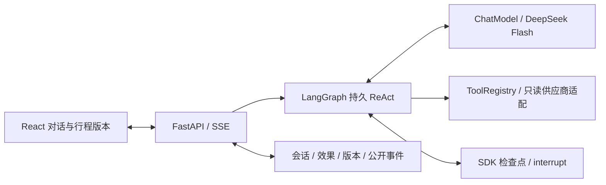

# Travel Agent · 多轮自主出行助手

[](LICENSE)

一个面向开放出行需求的单 Agent 助手：理解用户目标与限制，自主提问、查询信息，生成行程，
并在后续对话中调整已有安排。可以从明确目的地的旅行、尚未决定去哪的探索，或出差间隙的
游玩开始；这些是使用示例，产品不将需求硬编码为固定场景。

项目采用自主 ReAct，由模型决定下一步。低层 **LangGraph StateGraph** 负责持久化执行、
等待回复和恢复，直接复用模型与工具接口，不预设“先天气、再交通、再酒店”的业务流程。
默认模型为 **DeepSeek Flash（`deepseek-flash`）**，开启思考、`reasoning_effort=high`；
模型适配层可配置其他 OpenAI 兼容服务，具体供应商兼容性需单独验证。

目前面向中国大陆出行，操作范围是**只读查询与规划**，不下单、支付或取消预订。

## 主要能力

- **多轮自主追问**：模型根据当前需求和工具结果决定是否澄清，支持部分回答、未知目的地
  和限定范围的“你决定”；没有固定问卷、追问次数或答案模板。
- **真实工具查询**：接入高德、和风天气、博查，以及独立的票务、酒店和公开网页适配器。
  保留来源、查询时间、缺失、失败与覆盖边界。
- **行程版本与局部修改**：按稳定条目 ID 修改指定活动，检查连带转场、住宿与费用影响，
  保留未涉及的安排；网页可查看旧版本、修改原因及时间和费用差异。
- **固定安排保护**：区分用户锁定与用户自报已订，依据用户原话保护安排。自报已订不等于
  供应商已核验；冲突候选不会直接覆盖当前方案。
- **持久化执行与恢复**：完整用户、模型和工具历史保存在后端。浏览器断线不取消后台执行，
  公开事件支持重放；服务重启复用已提交效果并保留累计运行预算。
- **证据与一致性校验**：检查时间、转场及缓冲、开放窗口、固定安排、住宿和费用。
  草案仅在本轮成功交付时发布；未知费用不按零计，旧报价或条件不符时标记待复核。

恢复已通过 SQLite 与真实 PostgreSQL 的进程退出/重启、幂等、检查点围栏和可逆迁移验证；
真实 DeepSeek 样例也完成了生成方案、锁定安排、局部修改与版本交付。
这些是有限样例的验证，不代表所有城市、日期、账号或供应商均能返回完整准确结果。

## 数据来源与查询范围

| 能力 | 当前来源 | 主要边界 |
| --- | --- | --- |
| 地点、详情、位置与路线 | 高德 | 地图路线和费用是估计/参考，不替代指定日期票价；保留坐标系 |
| 天气 | 和风天气 | 每日、逐小时、当前预警及每日指数；保留实际时次和覆盖缺口，不插值或外推 |
| 网页搜索与公开页面 | 博查、公开 HTTP/HTTPS 页面 | 内容作为证据，不执行其中指令，也不当作实时库存 |
| 景点开放时间 | 高德描述、博查、公开网页 | 区分常规与指定日期证据；没查到闭馆公告不等于当天开放 |
| 铁路（含高铁列车） | 12306 优先；FlyAI 为显式候选或配置的降级 | 保留准确站点、席别、候补/无票/未开售；受阻与无票分开 |
| 普通汽车票/长途大巴 | 出行365；可显式配置其他适配器 | 保留实际站点、车型、展示价和页范围；机场/高铁接驳专线暂缓 |
| 机票 | FlyAI 候选；可按需核实东航公开列表 | 有限来源与候选范围，区分税前/含税价，不代表全市场或最终库存 |
| 酒店 | FlyAI | 房型、人数、税费、房价或库存可能缺失；不提供预订保证 |

票务、酒店和浏览器来源已经过有限真实样本验证。当前票务只验证单成人，酒店查询限一个
房间；多人报价、全部税费和可售库存不能从单人候选或列表价推定。
详细合同与来源限制见[报价契约](docs/quotes.md)、[浏览器票务](docs/providers/browser-tickets.md)
和 [FlyAI 适配说明](docs/providers/flyai.md)。

## 技术栈与架构

| 层 | 技术 |
| --- | --- |
| 前端 | React、TypeScript、Vite、pnpm |
| HTTP / 流式通信 | FastAPI、Pydantic、HTTP、SSE |
| Agent | 低层 LangGraph StateGraph、`ChatModel`、`ToolRegistry`、单 Agent 自主 ReAct |
| 持久化 | SQLAlchemy、Alembic；本地默认 SQLite，可配置 PostgreSQL；独立 SDK checkpoint saver |
| 开发验证 | uv、pytest、Ruff、Vitest；网页供应商使用独立 Playwright Chromium |



完整原始历史不摘要或裁剪，供应商要求回传的附加字段（如 `reasoning_content`）保留在私有
记录中。网页只显示公开答复、问题、工具状态和行程信息，不展示隐藏推理、原始工具参数或密钥。
当前不实现跨会话的长期用户偏好档案。

## 快速开始

### 环境要求

- Git、Python **3.11+**、[uv](https://docs.astral.sh/uv/getting-started/installation/)。
- 推荐 **Node.js 24.12+**。Vite/React 插件的基础要求为 `^20.19.0 || >=22.12.0`，
  部分 Linux 可选依赖要求更高版本，使用推荐版本可避免平台依赖差异。
- **pnpm 12.3.4**，版本声明位于 [frontend/package.json](frontend/package.json)。

当前开发验证环境为 Windows / Python 3.13 / Node.js 24。其他环境仍需验证所选浏览器和
供应商适配。Python 依赖由 [uv.lock](uv.lock) 锁定；uv 本身未声明最低版本。

### 1. 获取代码与本地配置

```sh
git clone https://github.com/zhouhang-jpg/travel-agent.git
cd travel-agent
```

首次使用时复制 [.env.example](.env.example) 为 `.env`，再自行填写凭据。
**已有 `.env` 请保留，只补充需要的字段；不要打印、粘贴或提交密钥。**

PowerShell：

```powershell
if (-not (Test-Path .env)) { Copy-Item .env.example .env }
```

macOS / Linux shell：

```sh
cp -n .env.example .env
```

后端从工作目录读取 `.env`，下文的后端与迁移命令均在**仓库根目录**执行。
使用对话 Agent 至少填写 `DEEPSEEK_API_KEY`；默认地址、模型、思考参数和执行引擎已在
示例配置中给出。按需要配置数据服务，不必一次启用全部供应商。

| 用途 | 配置入口 |
| --- | --- |
| 默认模型 | `DEEPSEEK_API_KEY`、`DEEPSEEK_BASE_URL`、`DEEPSEEK_MODEL` |
| 其他兼容模型服务 | `LLM_PROVIDER=openai_compatible`，并配置 `LLM_API_KEY`、`LLM_BASE_URL`、`LLM_MODEL` |
| 地图 | `AMAP_API_KEY` |
| 天气 | `QWEATHER_API_KEY` 与账号对应的 `QWEATHER_API_HOST` |
| 网页搜索 | `BOCHA_API_KEY` |
| 网页铁路、大巴、东航 | `BROWSER_QUERIES_ENABLED` 及浏览器运行时，见下一步 |
| FlyAI 机票/酒店及可选铁路 | 正式 Key、固定 CLI 与 Node 路径，见 [FlyAI 文档](docs/providers/flyai.md) |
| 数据库 / 引擎 / 预算 | `DATABASE_URL`、`AGENT_ENGINE`、`AGENT_MAX_STEPS`、`AGENT_MAX_RUN_SECONDS` |

环境变量优先于 `.env`；空凭据表示供应商未配置。账号权限、配额、费用和端点由使用者核对。
未配置或查询失败会如实报告，不用模拟数据替代真实查询。`.env`、私有数据库、缓存和原始
验收产物已被 Git 忽略，密钥只放后端。

### 2. 安装依赖与所选工具运行时

仓库根目录执行：

```sh
uv sync --locked
```

使用网页铁路、普通大巴或东航时，额外安装独立浏览器，并在 `.env` 设置
`BROWSER_QUERIES_ENABLED=true`：

```sh
uv run playwright install chromium
```

铁路默认 `TRAIN_SEARCH_PROVIDER=12306`，大巴默认 `COACH_SEARCH_PROVIDER=bus365`。
FlyAI 降级或候选需要单独准备；正式 Key 与体验模式均不会自动启用。
如选择 FlyAI，在 PowerShell 执行固定版本准备脚本，再按文档配置真实的 `FLYAI_NODE_PATH`、
`FLYAI_CLI_PATH` 和正式 Key（或显式选择受限体验模式）：

```powershell
powershell -NoProfile -File scripts/setup_flyai.ps1
```

脚本核验归档后安装到项目内，不全局安装、不执行 npm 生命周期脚本。
浏览器不使用个人登录态，也不处理或绕过验证码。其他平台与来源配置见[供应商文档](#文档导航)。

### 3. 初始化数据库并启动

**全新数据库**可先通过 Alembic 建表并登记版本（默认 SQLite 缺少的 `private/` 目录会自动创建），
再启动后端：

```sh
uv run alembic upgrade head
uv run uvicorn travel_tools.api:app --host 127.0.0.1 --port 8000 --workers 1
```

**已有数据库不要直接照此初始化**，先阅读下一节的备份、版本核对与升级条件。
另开一个终端，从仓库根目录进入前端：

```sh
cd frontend
pnpm install
pnpm dev
```

打开 [http://127.0.0.1:5173/](http://127.0.0.1:5173/)；Vite 将 `/api` 代理至后端。
接口文档位于 [http://127.0.0.1:8000/docs](http://127.0.0.1:8000/docs)。
首次安装无需先运行完整测试；开发验证命令列在后面。

## 数据库与运行边界

本地启动会创建缺失表，但 `create_all` **不建立 Alembic 版本记录，也不升级已有列**。
默认会话库为 `private/travel-agent.db`，SQLite 检查点为同名 `private/travel-agent.db.graph`；
两个文件都需要备份。部署可配置 `postgresql+asyncpg://...`，PostgreSQL 的应用表与 SDK
saver 表同样需要一致备份。

已有数据库升级前，先停止接收新任务、等待当前运行结束、停服务并备份。核对 Alembic 版本后
从仓库根目录执行：

```sh
uv run alembic current
uv run alembic upgrade head
```

如果旧库没有 `alembic_version`，须先核对旧 schema 再选择正确迁移基线，不能无条件
`upgrade` 或盲目 `stamp`。SDK saver schema 由固定版本的 `setup()` 单独管理，不归应用
Alembic 管理；降级不能假定旧运行器能够恢复新图线程。
具体条件见[持久运行说明](docs/durable-runtime.md)。

- 当前仅支持**单应用进程、单 worker**，没有生产身份认证或租户隔离；本地命令绑定
  `127.0.0.1`，不能直接当作公开多人服务部署。
- 执行中不支持用户插话、取消或并行输入同一会话；等待回复或本轮结束后才能继续。
- 每条新接受输入默认最多 **12 次模型请求、300 秒主动执行**，单次模型请求默认120秒。
  恢复不重置已提交预算，等待用户/停机时间不计入主动执行。
- 不设置应用层上下文长度、模型输出长度或工具总次数上限；供应商自身容量、截断、拒绝和
  资源超限仍需明确报告。失败不自动切换模型系列。
- 来源对应与校验只检查提供数据的一致性，不能保证全部需求已覆盖、未来可售库存、
  预订真实或行程安全。用户自报、估计、部分结果和未知保留各自语义。
- 供应商并行与结果复用、完整方案比较、地图/时间轴/导出及主动提醒**仍待实施**，
  详见[后续迭代计划](docs/next-iteration.md)。

## 开发验证

在仓库根目录运行离线回归与构建检查，不需要调用模型或付费供应商：

```sh
uv run pytest -q
uv run ruff check .
uv run ruff format --check .
uv run python scripts/check_examples.py
pnpm --dir frontend test
pnpm --dir frontend build
```

真实 PostgreSQL 验收需要显式配置 `TRAVEL_TEST_POSTGRES_URL`，指向可创建/删除临时数据库
的独立测试服务器；未配置时相关用例明确跳过，SQLite 通过不替代 PostgreSQL 验收。
不要把该测试变量指向生产数据库。

真实联调需显式执行，**会消耗已配置模型/供应商额度**。这些是验收样例，不是业务流程：

```sh
uv run python scripts/live_probe.py --providers
uv run python scripts/live_probe.py --providers --amap-all-modes
uv run python scripts/live_probe_durable.py --live
uv run python scripts/live_probe_itinerary_edit.py --live
uv run python scripts/live_probe_tickets.py --live
uv run python scripts/live_probe_weather.py --live --model
```

结果保存在忽略的 `artifacts/`，部分探针包含隔离会话库和完整私有记录，不应公开上传。
缺配置不计作成功，失败不替换为无票；一次样本成功不证明供应商长期可用。
更多入口见 `scripts/live_probe_*.py`，Schema 可用 `uv run python scripts/export_schemas.py`
离线导出。CI 状态以 GitHub Actions 为准，不以本地验证代替。

## 文档导航

| 主题 | 文档 |
| --- | --- |
| 架构与恢复 | [技术路线](docs/technical-roadmap.md)、[ADR-0001](docs/adr/0001-durable-react-runtime.md)、[持久运行](docs/durable-runtime.md) |
| Agent 与模型 | [行为及完整上下文](docs/agent-behavior.md)、[DeepSeek 接口](docs/providers/deepseek.md) |
| 行程与版本 | [版本、局部修改与验收](docs/itinerary-versions.md)、[校验规则](docs/itinerary.md) |
| 工具与报价 | [工具层](docs/tool-layer.md)、[报价合同](docs/quotes.md)、[开放时间](docs/opening-hours.md) |
| 地图/天气/搜索 | [高德](docs/providers/amap.md)、[和风](docs/providers/qweather.md)、[博查](docs/providers/bocha.md) |
| 票务与酒店 | [浏览器来源](docs/providers/browser-tickets.md)、[FlyAI](docs/providers/flyai.md)、[供应商比较](docs/providers/ticket-suppliers.md)、[聚合铁路](docs/providers/juhe-train.md)、[极速大巴](docs/providers/jisu-coach.md) |
| 前端与后续工作 | [前端说明](frontend/README.md)、[验证记录](docs/verification.md)、[后续迭代](docs/next-iteration.md) |

示例：[正常安排](examples/itinerary-valid.json)、[冲突安排](examples/itinerary-invalid.json)、
[证据不足](examples/itinerary-unknown.json)。示例使用合成证据，不是实际供应商结果。

## 许可证

项目采用 [MIT License](LICENSE)，版权声明为 **Copyright (c) 2026 zhouhang-jpg**。
允许使用、复制、修改、分发和商用；分发软件副本或重要部分时，需保留版权与许可声明。
完整授权条件及免责条款以 LICENSE 英文原文为准。

第三方依赖分别遵循各自许可证。模型、外部 API、供应商服务、数据与素材不由本项目 MIT
许可授权，其使用、配额、计费与再分发依各自条款；API 凭据由使用者自行配置。
