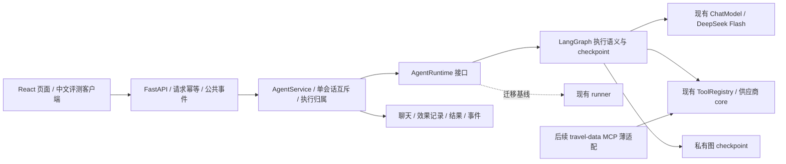

# 下一阶段技术路线与验收

日期：2026-10-10（America/Chicago）。迁移前实现基线：`f16de6c`。
M1 已实施并通过 SQLite / 真实 PostgreSQL 恢复验收，默认新会话已切换 LangGraph；
具体实现与部署限制见[持久运行说明](durable-runtime.md)。下文保留设计依据与后续门槛；
M2–M5仍为待实施方向，下一轮范围已细化为[可靠局部修改](next-iteration.md)。
选型决定见 [ADR-0001](adr/0001-durable-react-runtime.md)。

## 1. 当前能力与选定方向

| 状态 | 内容 |
| --- | --- |
| 当前已实现 | React/TS/Vite、FastAPI/Pydantic、`ChatModel`、`ToolRegistry`、LangGraph持久ReAct；多次 `ask_user`、完整journal、问题/答案幂等、公共事件重放、无损工具表示、来源引用、现有行程一致性校验 |
| 当前部署边界 | 单应用进程/单 worker、本地默认 SQLite；真实 PostgreSQL 17恢复验收已通过；活动任务仍在内存但可由持久cursor恢复，无用户归属鉴权 |
| 当前方向 | 模块化单体，单 Agent 自主 ReAct；低层 LangGraph `StateGraph`直接复用模型及工具接口 |
| 默认引擎 | LangGraph接替未绑定版本的新会话默认执行层；旧runner保留基线/回退，已有图线程保持绑定 |
| 后续能力 | 需求/事实校验、中文多轮评测、工具 MCP 入口、有限并行、派生时间线/地图；多用户和多实例另设准入门槛 |

迁移前仅保存记录，未保存执行位置。legacy `storage.recover_runs()` 把正在执行的任务标成中断，
`repair_history()` 为悬空工具调用补错误；下一条消息重新进入模型循环。等待回复可恢复聊天，
但没有持久化的问题关联或答案消费记录。`service` 的活动任务、SSE 队列和失败保存补偿也在
进程内。现有 `active_run_id/revision` 提供一部分隔离，`append_message()` 仍是读取后修改
ORM 对象，其他写入不检查受影响行数；它们不构成完整租约 fencing 或多实例恢复保证。

`validate_itinerary` 已检查时间、转场、营业窗口、固定安排、住宿和预算一致性。
它**不验证来源真实性/时效，也不证明输入完整覆盖用户原始需求**，见[现有边界](itinerary.md)。
本路线扩展它的输入证据和检查项，不重写已有算法或把 `unknown` 当通过。

## 2. 模块职责



图只表达 `model_decide → tool_batch → model_decide`、发布问题/等待/恢复、完成或错误。
LLM 决定提问、工具、顺序及交付；不放入“先问完、先天气、先酒店”等业务步骤。
`ask_user` 仍须单独调用；混合调用整批返回原协议错误，不执行一部分。
工具 batch 首阶段串行，逐项保存结果；未来并行不改变模型返回的入历史顺序。

继续使用 `ChatModel.complete(messages: list[dict], tools: list[dict])` 与
`ToolRegistry.dispatch()`。不要求迁入 LangChain 消息/模型抽象。原始 assistant 对象、
`reasoning_content`、供应商附加字段和 tool 内容字符串完整保存回传；图 state 使用私有
消息引用与版本，不作为另一套“简化聊天”。系统环境仍按调用生成，提示词/工具版本按 run 固定。

## 3. M1：最小持久化 ReAct 与可恢复追问闭环

这是首个实施里程碑；不依赖 MCP、旅行状态扩展、并行或地图。

### Runtime 接口与改动位置

以下是设计阶段的职责契约；落地的 `ExecutionRuntime.execute(lease)` 与 `RuntimeService`
接缝见 `src/travel_agent/runtime.py`，具体恢复交给图cursor，未另造start/resume调度器：

```python
class AgentRuntime(Protocol):
    async def start(self, context: RunContext, input_message_id: str) -> RuntimeOutcome: ...
    async def resume(
        self, context: RunContext, answer_message_id: str, question_id: str
    ) -> RuntimeOutcome: ...
    async def recover(self, context: RunContext) -> RuntimeOutcome: ...
    async def inspect(self, conversation_id: str) -> PublicRunView: ...
```

`RuntimeOutcome` 保持 completed/waiting_user/error 语义，返回私有结果引用与安全错误。
`RunContext` 包含当前 run、租约代际、引擎版本和预算，不含密钥或持久化客户端对象。

| 接缝 | M1 改动 |
| --- | --- |
| `src/travel_agent/service.py` | 注入 runtime factory，替换硬编码 `AgentRunner(...)`；负责请求入库、执行归属、启动/恢复和公共事件订阅，不自建节点调度器 |
| `src/travel_agent/storage.py` | 用 Alembic 增加运行/请求/问题/效果/事件记录与原子写入；恢复时不再把图任务一律修成错误后重跑；legacy 路径保持独立 |
| `src/travel_agent/api.py` | 现有会话和消息端点保留；消息增加可选 `request_id/question_id`；等待回答走 resume，普通新消息走 start；运行中输入仍409 |
| `src/travel_tools/api.py` | 构建 runtime/checkpointer 生命周期；未来升级使用迁移，不能让 `create_all` 冒充已完成 schema 升级 |
| 前端/SSE | 生成并复用请求幂等ID、回答绑定问题、按事件ID去重；原事件类型保留，增加事件序号/问题ID；断流用 GET 会话恢复，并新增事件续订入口 |
| 模型/工具 | 接口与真实供应商适配保持；增加效果记录钩子以复用结果及识别恢复重试，不用测试fixture降级 |

新增事件续订拟用`GET /conversations/{id}/events?after_event_seq=N`，先重放持久事件再订阅。
旧客户端没有request_id时可生成服务端接收ID，但不能承诺识别客户端重复投递；新版页面与
评测驱动必须保存/复用ID。缺question_id仅在存在唯一未消费问题且事务校验通过时兼容绑定。

### 标识与预算契约

| 标识 | 责任 |
| --- | --- |
| conversation_id | 稳定聊天身份；未来还须绑定用户归属，UUID本身不是授权 |
| thread_id | 从 conversation + engine/state 版本映射的稳定图线程，跨多次用户消息的 run 保持；不是每次重试随机新建 |
| run_id | 每条**新接受的用户消息**触发的一轮主动执行，沿用现有定义；故障恢复保持原 run；用户回复问题才创建新 run |
| lease_epoch / owner_token | 每次执行归属更换递增；旧执行者所有结果、状态、事件及 checkpoint 写入均须隔离，只有 run_id 不够 |
| step_id / attempt_id | 稳定逻辑模型决策及真实请求尝试；复用已保存回复不算新决策，不确定完成后的再次模型请求要记新尝试 |
| tool_call_id | 保留供应商原ID；效果唯一键须带 producing run/step 作用域，不能假定跨运行全局唯一 |
| question_id | 由产生问题的 run/step/tool_call_id 稳定映射，绑定 engine/state version/checkpoint；只接受一次答案 |
| request_id | 客户端请求幂等ID；同ID同内容返回原接受结果，同ID不同内容冲突；不是凭文本相同就去重 |
| event_seq / message_id | 会话内持久递增的公共事件序号与稳定消息ID；跨run可续订、去重，不等于模型决策次数 |

保留每轮默认 **12 次模型请求、300 秒主动执行** 和原模型请求/工具时限。
新用户回复开启新 run 预算；同 run 故障恢复保留累计计数和剩余时间，不重新给12/300。
等待用户与停机时间不计入主动执行。主动计时用单调时钟，并在运行记录中周期性持久化；
进程死亡末尾的不可观测误差要明确记录/验证持久化精度，不用当前壁钟减开始时间计入停机。
模型请求开始前原子记账；已保存回复只重放，不再次收费计数。恢复重发请求需标识并使用剩余预算。
明确的ModelError继续按当前错误语义处理，不给图节点默认自动重试；只有故障恢复中的
未知完成尝试可按记录/预算重发。每次请求仍受剩余主动时间及原单请求时限约束。

框架 super-step 不是模型请求。tool batch 不按每个工具拆成消耗预算的模型步骤。
LangGraph 内部 recursion_limit 要按协议节点数推导并验收，不能沿用默认值而提前切断12轮，
也不能让它隐式限制工具总数。**不新增工具总数、上下文、模型输出上限，不摘要裁剪。**

### 三类持久化权威与事务边界

| 数据 | 权威职责 | 不负责什么 |
| --- | --- | --- |
| 原始消息 journal | 完整用户/模型/工具 payload、顺序、消息版本与来源引用的事实底稿；图引用它构造完整上下文 | 不保存自研 next_node/恢复游标 |
| 运行/效果/业务结果/公共事件 | 请求接受、问题与答案消费、租约和预算；已提交模型/工具结果、最终交付、可重放事件 | 不另造状态机与图争夺执行位置 |
| LangGraph checkpoint | 唯一执行位置、待运行节点和 interrupt 恢复 state 的权威；使用标准 saver/序列化契约 | 不代替聊天、最终结果事务或用户归属鉴权 |

旧 `Conversation.history/transcript` 迁移期可作为兼容投影；选定 journal 后不能两边任意写。
旧 JSON 保留原 payload，用稳定消息ID映射，不转换/删掉模型附加字段。原始 history 与公开
transcript 不一一对应，不能通过公开正文重建私有 history。旧 runner 的 checkpoint 回调
只作 legacy 记录钩子；图路径不再依靠它控制恢复。

业务数据库事务同时提交效果记录、相关原始消息、运行状态和公共 outbox 事件。
checkpoint 与业务结果**不假定同事务**：图节点重跑先查稳定效果键，完成节点先查已提交
最终结果；已提交结果但 END checkpoint 尚未落库时，不再生成新回答或重复发布事件。
SSE 由持久事件投影送出，Queue 仅作唤醒优化，不是恢复权威。

图 checkpoint 自身也须 fencing，不能只保护业务表而容许旧 saver 覆盖恢复状态。
首个 spike 必须证明：标准 saver 的 put/pending-writes 能在租约条件的同一DB事务内保护，
或以代际隔离存储和受 fencing 保护的 checkpoint 选择引用实现同等效果。
“先查租约再用另一连接写 checkpoint”存在竞态，不作为完成方案。后者只保存库的引用，
不自建恢复游标；必须验证标准 interrupt/pending-writes 仍正确。未证明时不切默认引擎。

PostgreSQL 是部署目标，SQLite 是本地验证选项。优先验证标准异步 PostgreSQL/SQLite saver，
与现有 SQLAlchemy 事务边界分清；PostgreSQL saver 与 asyncpg/psycopg 驱动兼容不能想当然。
schema 通过 Alembic 升级/回退；库自带 checkpoint schema setup 单独管理和记录版本，
不用 Alembic 臆测第三方表结构。先在隔离库验证，迁移用户库需要独立实施任务。

### 问题与恢复的最小纵切

1. API 原子接受 request_id，保存用户原文，取得租约；已有请求不创建第二个 run。
2. model node 读取 journal 的完整版本，通过原 ChatModel 决策；按效果键保存完整回复。
3. tool batch 逐项复用已提交结果，或执行只读查询并原子保存结果/消息/事件。
4. `ask_user` 用 publish-question 节点一次提交问题草稿和原 tool 结果；纯 wait 节点再
   调用 `interrupt()`。确认等待checkpoint已持久化后，事务把问题设ready，关联checkpoint，
   发布公共问题/事件并释放主动租约。不能先让用户答题再保存等待位置。草稿与checkpoint
   之间退出时可重入；checkpoint已保存但ready未提交时协调一次发布，不重新问。
   恢复从wait节点开头执行，所以wait前面没有模型/外部查询或重复发布的副作用。
5. 回答API在事务内绑定 question_id，保存用户消息与唯一消费关系，创建新run；
   用 `Command(resume=...)` 传已保存答案的引用，在同一thread继续。不要再次追加用户原文，
   也不改写原 ask_user tool 结果；后续模型可以再次提问或直接交付。
   接受答案后、发送resume前退出，要恢复该已接受请求；若checkpoint已消费这份答案并
   前进，则不再次resume，更不能把旧答案投给后来出现的新问题。恢复按绑定的question/
   checkpoint标识协调，而不是“拿最新答案填当前interrupt”。
6. 启动恢复只选择可恢复的当前 engine/version/run；旧owner被隔离后才能继续，不全表清租约。

interrupt 只用于系统主动等待回答，不引入用户运行中插话/取消。答案未就绪可继续等，
不能把重启自动填成“用户同意”。已完成工具复用原查询时间，过期或条件改变标需复核。
外部查询完成但保存前退出时无法确定结果，允许只读重试，记录旧未知尝试和新取数时间；
模型请求中退出也可能需重发。**内部提交可幂等，外部调用不承诺 exactly-once。**

### M1 验收门槛

| 场景 | 必须看到的完成证据 |
| --- | --- |
| 连续追问、部分回答、你决定、未知目的地 | 同会话多次等待/恢复；已知条件不重复问，授权范围不扩张；未知目的地可探索；不按问次数评分 |
| 等问题时重启 | 独立服务进程真正退出并重新启动，相同question_id可继续，问题/答案不重复；等待不消耗300秒 |
| 问题/答案跨事务窗口 | 草稿后、interrupt保存后ready前、答案接受后resume前、resume推进后退出分别验证；不出现提前可答、重复提问、丢答案或旧答案答新题 |
| 模型请求中重启 | 原run恢复，完整历史/版本保留；不确定请求标重试，计数不归零，费用不声称只发一次 |
| 工具完成与保存间退出 | 可控failpoint终止真实进程；已提交结果复用，未提交只读重试有标识；不伪造成功/零结果 |
| 最终保存后SSE断线 | GET会话/事件续订取回一次最终结果，不重新生成、重复追加或因断流取消任务 |
| 同一答案重发/同ID不同正文 | 一次接受/一次消费/一个run；冲突明确；已被其他答案消费的问题拒绝后续竞争答案 |
| 旧执行者晚到 | 旧epoch对消息/效果/状态/事件/checkpoint写入被拒绝；注入延迟与归属更换证明，不能仅看最终状态 |
| 12轮/300秒与完整历史 | 12轮含大量工具仍可执行；同run恢复计数累计，等待/停机不计时；完整DeepSeek附加字段逐条续跑相等 |
| 错误、未知、时效与既有回归 | 供应商受阻不是无票/无雨，候补不是有票，过期数据不冒充新查；现有API事件及全部工具/校验回归不退化 |
| PostgreSQL与迁移 | 真PostgreSQL进程上的上述关键恢复/并发写入和Alembic升降级通过；SQLite证据单列，不冒称部署目标完成 |

普通对象重建、数据库关闭重开或 mock 无异常不能替代进程恢复证明。隔离测试驱动先用
可控模型/工具服务注入退出位置，记录PID/重启、效果尝试和事件序列；再用少量真实模型及
供应商查询做行为/协议验证，不能把模拟结果混入生产。UI/SSE只送现有白名单类型及新增
稳定ID/seq，禁止原始graph state/stream、隐藏推理、参数、工具结果或凭据直通。

## 4. 后续里程碑

| 顺序 | 最小交付 | 验收重点 |
| --- | --- | --- |
| M2 需求与事实校验 | 三类本会话派生对象：需求条目、行程版本、证据引用索引；保留原消息/版本，区分用户确认/工具观测/模型假设 | 在已有校验器上检查当前需求覆盖、候选端点/日期/价格/库存/来源一致性与时效；改条件使不适用证据需复核；继续pass/fail/unknown/not_applicable |
| M3 中文多轮评测与可观察性 | 网页和评测客户端调用同一runtime；版本化用例、隔离重放记录和真实在线模式；从现有clarification/followup探针提炼 | 分开衡量查不到、读错、规划错、该问/不该问、整单约束通过；记录模型/提示词/工具/engine版本、错误、耗时和实际usage/token（含嵌套明细），不加token上限 |
| M4 MCP薄适配 | 一个travel-data server先暴露天气、地点等成熟只读core；同schema/handler，内部直调保留 | stdio真实客户端发现/调用与内部结果等价、错误不变空列表、启动关闭无泄漏；ask_user/会话管理留内部；不作为M1依赖 |
| M5 并行和展示 | 独立只读工具受供应商限流/浏览器串行及并发预算约束，按模型原顺序写历史；时间线/地图由已有结构数据派生 | 故障/取消后的结果顺序可重复，不产生新事实；记录坐标系/未知段，不补造路线和库存 |

M2 状态是当前会话的最小索引，不是长期用户偏好，不替代完整history，不照搬重型交付对象。
M3 的 fixture/replay 必须显式隔离、禁止生产回退；缓存和真实在线重查的时效分别记录。
MCP远程确有调用需求后才用Streamable HTTP和鉴权，票务可后续加入；接口封装不提高数据真实性。
多worker/多人API须另过会话归属鉴权、租约fencing、checkpoint共享和事件跨进程分发验收。
换Postgres/LangGraph不等于上述能力完成；暂不引入Redis/Celery/Kafka、多Agent、RAG、长期记忆或微调。

## 5. 可提交与可回退的迁移顺序

| 提交批次 | 完成证据 | 回退边界 |
| --- | --- | --- |
| 0：runtime接缝与行为基线 | Legacy适配现接口，现有网页/API/真实模型语义无退化，版本化样例 | 删掉接缝不改变用户记录；无LangGraph数据 |
| 1：纵切spike | 固定库版本，验证原始JSON引用、异步saver、事务/fencing、interrupt重入、预算与真实进程恢复；不先造完整自研checkpoint | 隔离库与测试引擎，不写用户库 |
| 2：M1迁移与图实现 | Alembic可回退，请求/问题/效果/事件与checkpoint接成一条可运行纵切；测试开关可选engine | 新图run绑定版本，不把其checkpoint交旧runner |
| 3：全门槛验收与新运行切换 | M1表中证据与Postgres测试报告齐备，才改新运行默认 | 开关主要影响新run/新thread；已有挂起图run继续兼容版本 |
| 4：M2–M5分批 | 各自测试、版本和功能开关；不与首次恢复切换捆绑 | 关闭派生能力不删除原消息、结果与图恢复证据 |

同一run不能由两个引擎同时执行。已有waiting_user绑定engine/graph/state版本：优先保留
兼容runtime续跑；确需停用版本时走明确的恢复/导出流程，保留原记录和未消费问题，再经
独立迁移生成新thread/run映射。不能按回退开关直接把checkpoint当history交旧runner。
schema降级前检查新数据和挂起运行，先备份/隔离；不能downgrade后宣称旧程序仍能恢复新图。
回答挂起问题虽产生新run，仍使用该thread绑定的图版本，不能按全局新运行开关改走旧runner。
M2校验只能验证原始候选/需求/来源元信息的一致性和新鲜度，不独立证明上游事实真实或可成功预订。

## 6. 首个实施任务与未决技术问题

M1已完成runtime协议与legacy适配、隔离库saver/fencing验证、
Alembic和原始消息/运行/请求/问题/效果/事件最小表；通用model/tool/publish/wait/final图；
现有service/API接入幂等和resume；持久事件与前端去重；真实进程failpoint与Postgres验收。
M1保持独立提交，后续产品功能不混入恢复验收。以后任何引擎迁移闸门失败不切新默认。

工程取舍已经记录在持久运行说明；以下是后续升级仍需重新验证的边界：

- LangGraph及独立checkpoint包的兼容版本、`ainvoke`/interrupt/sync durability实际签名和serializer行为；官方网页会更新，依赖须固定。
- 异步Postgres saver驱动/连接、原子fencing或代际存储隔离方案；不能仅保护业务表。
- 活跃计时持久化精度与崩溃尾部误差、当前进程退出证明/租约归属策略；本阶段只部署单进程。
- 旧history/transcript映射和挂起engine升级兼容性；回答未带question_id的旧客户端如何只在唯一待答问题时安全兼容。
- 预警/票价/库存的具体新鲜度规则在M2验证，缺数据时间不能硬填统一“有效期”。

## 7. 参考及采用边界

本轮核实官方[Graph API](https://docs.langchain.com/oss/python/langgraph/graph-api)、
[interrupts](https://docs.langchain.com/oss/python/langgraph/interrupts)与
[persistence](https://docs.langchain.com/oss/python/langgraph/persistence)：StateGraph可独立接
现有模型；compile传checkpointer，config.configurable.thread_id标识线程；等待用interrupt，
续答用Command(resume=...)，暂停节点重入从函数开头执行；recursion_limit是顶层config。
持久化部署saver与InMemorySaver示例不同，后者不能证明进程恢复。具体签名以spike固定版本为准。

| 资料 | 借鉴 | 不采用或未证明 |
| --- | --- | --- |
| [Ask-before-Plan澄清](https://github.com/magicgh/Ask-before-Plan/blob/37576b24a2aeb82753e7b4cdfce7fbb36583b1f4/src/clarification/consultant.py)、[评测](https://github.com/magicgh/Ask-before-Plan/blob/37576b24a2aeb82753e7b4cdfce7fbb36583b1f4/evaluation/clarification/eval.py) | 按对话和工具轨迹评价提问必要性/针对性 | 不强制每次先问，不照搬数据集问答流程 |
| [ChinaTravel](https://github.com/LAMDA-NeSy/ChinaTravel/blob/f445e0011f42594fcc29b8c752ece06ded9a8218/chinatravel/symbol_verification/commonsense_constraint.py)、[TravelPlanner](https://github.com/OSU-NLP-Group/TravelPlanner/blob/e52c87f4ac348a3410c46dc3553c519db5ec5e23/evaluation/eval.py) | 需求/环境约束分层、整单通过与错误归因 | 离线数据及模拟交通不是生产供给；中国/美国基准假设不是产品边界；代码/数据许可分别核实 |
| [JourneyPilot checkpoint](https://github.com/Lagom-TA/JourneyPilot/blob/20a79d5f27f9366b77970ba1741ed0b0dba97f7f/src/travel_agent/infrastructure/checkpointer.py)、[事实对象](https://github.com/Lagom-TA/JourneyPilot/blob/20a79d5f27f9366b77970ba1741ed0b0dba97f7f/src/travel_agent/entities/delivery_bundle.py) | 事实/结果与checkpoint职责、跨事务幂等 | 已核MIT；单用户固定流程与重型模型不照搬，未做该项目在线验收 |
| [FloatTrip等待协议](https://github.com/shouzhuoshouzhuo/FloatTrip/blob/8c8972f5c82b2bf7bdf99b6874c3b7a3d95a6971/app/chat/tool_service.py) | 暂停/回答/续跑的交互语义 | 未发现明确许可，仅借设计、不复制代码；摘要/固定规划/目的地必填不采用 |
| [Azure MCP注册](https://github.com/Azure-Samples/azure-ai-travel-agents/blob/67e16b9075cc1f9e279e4dfae1d7102b9bef6c8e/packages/api-maf-python/src/orchestrator/tools/tool_registry.py)、[工具](https://github.com/Azure-Samples/azure-ai-travel-agents/blob/67e16b9075cc1f9e279e4dfae1d7102b9bef6c8e/packages/mcp-servers/itinerary-planning/src/mcp_server.py) | 注册、连接生命周期及部分失败 | 机酒mock不是实际查询数据，不照搬其多Agent/历史丢失路径 |
| [MCP传输规范](https://modelcontextprotocol.io/specification/2025-06-18/basic/transports) | stdio与Streamable HTTP职责 | MCP不是状态恢复/数据正确性/鉴权的替代；版本在实际接入时固定 |
